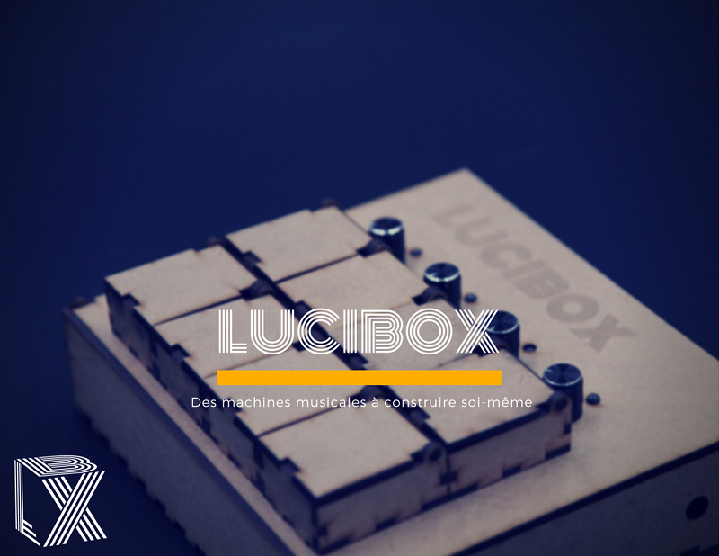

# Lucibox

This is about music, machines and D.I.Y

> La documentation en français se trouve au bas de cette page

**Lucibox** is more than an a software, it's a concept that allow people to create their own musical machine

This project is created from **Un Des Sens**
[ http://AssoUnDesSens.fr/lucibox
](http://assoundessens.fr/lucibox)

It's a french project, so the website is only in french right now, but the code approach is in english, and the "github" approach too.

# Concept

At the contrary of a workstation, Lucibox is not only a musical software to play sitted in front of your desktop. It is a software to create musical machine, play live,  indeed headless and controlled from interface.

 1. Try the software on your computer
 2. Control it with an arduino, keyboard, or midi controler
 3. Switch from computer to Raspberry Pi
 4. Build the enclosure
 5.  You have now a musical machine

## Education

The first goal about this project is a musical approch about arduino, raspberry pi, and D.I.Y stuff.  The first folder, called "exemple", means that their exemples inside are used during arduino workshop, in order to discover both the origines of electronic music and D.I.Y culture.

## Personalized musical machine
The second goal of this software is to personalize machine, for musician , that have specials need and special esthetics.

# Software

Software is based on [PureData](https://puredata.info)  ( or Pd ) 
Externals are included, just download PureData, and Lucibox.
Puredata work on all platform, that's make the code really easy to move from desktop to Raspberry Pi.

# Controler

The software can be controlled from Arduino ( serial ), midi controller, or keyboard ( including Makey Makey board ).  All arduino sketches and shematics are free to use.

# How to begin ?
 1. Download PureData [PureData](https://puredata.info) 
 2. Install it and configure sound [ Link ](http://write.flossmanuals.net/pure-data/configuring/)
 3. Download Lucibox project, from the Github button ( **Clone or download** ) or directly this [link](https://github.com/undessens/Lucibox/archive/master.zip)
 4. Explore the folders, plug the headphone and enjoy.
 

# What are the folder?

## Exemple

Contains exemples of how the software can be used. For each exemple, you can control it using only the computer mouse, or a controller if you want. 

## Machines

A machine is the result of a headless raspberry pi, containing the lucibox program and working as an hardware audio material. It can be an effect pedal , a sampler , and loopstation. More than the software, there is the entire documentation of the components and the materials you need.
There is also a link to the raspberry pi image, that's make the machine easy to build, for any people far or close from the D.I.Y stuff. ( note that the RPI image are not included in the git)

## Patches 

Contains all the PureData Patches that the program needs. They are documented in a specific doc file, in the documentation folder.

## Sample

Contains samples of "one shot" sound and drum loops. These samples are shared samples. The samples from loopstation saving its sessions are located in the folder of the exemple or the machine using the looper.

## Docs

This is the generic documentation platform of the project.  How the software work, the list of component and card compatible with this project. Perspectives ... etc

 

------

# Français

------

> English documentation is above

**Lucibox** est plus qu'un simple logiciel, c'est tout en environnement pour permettre à chacun de venir créer ses machines musicales.

Ce projet est porté par l'association  **Un Des Sens **

Retrouvez tous les projets de l'association sur notre site : 

[http://assoundessens.fr/lucibox]: http://AssoUnDesSens.fr/lucibox	"Asso Un Des Sens"

# Principes généraux

Dans la vision lucibox, la musique et le numérique  dépasse le logiciel de musique sur ordinateur. Luxibox est pensé pour créer des machines musicales,  autonomes, qui permettent de jouer en live, sans écran, mais avec tout une gamme de controleurs.

1. Essayer le logiciel sur son ordinateur
2. Controler le logiciel depuis une carte arduino, un clavier, une carte makey makey ou un controleur midi
3. Executer le programme sur un raspberry pi
4. Construire le boitier , intégrer les controleurs
5. Une nouvelle machine musicale est née

## Education

Ce projet est utilisé comme une nouvelle manière de découvrir arduino, raspberry pi, et la culture D.I.Y.  Le dossier *exemple* contient des exemples utilisés durant des atelier arduino pour découvrir les origines de la musique electroniques, et découvrir la logique D.I.Y et le monde de l'open source.

Ces ateliers, sont organisés par l'association 

[Un Des Sens]: http://assoundessens.fr/atelier	"atelier"

## Machine personnalisés

Le deuxième but de se projet est de créer des machines personnalisés pour les musiciens, en fonctions de leur besoins, et de leur atmosphere esthetique de jeu. En gardant toujours à l'idée, que ses machines artisanales, sont contrairement à l'industrie, réparable, améliorable.

## Musicalement parlant

Il est possible de créer différents genre de samplers, de loopers à plusieurs voix, des lecteurs des fichiers , des effets audio et des synthetiseurs. Tous syncronisés ... bien entendu.

# Logiciel

Le logiciel est basé sur  [PureData](https://puredata.info)  ( or Pd ) , un logiciel libre, fonctionnant sur la plupart des platformes.

Tout les dépendances sont incluses, il suffit juste de telecharger PureData et l'ensemble du git Lucibox.

PureData fonctionne sur Raspberry Pi, ce rend le code completement transposable d'un ordinateur à un raspberry pi

# Controleur

Il est possible de controler le logiciel depuis une carte Arduino ( serial), des controleurs midi, des touches de clavier , et la carte Makey Makey, qui est reconnue comme un clavier.

Les codes arduino et les shémas de branchement sont fournis dans la doc.

# Comment commencer ?
 1. Télécharger PureData [PureData](https://puredata.info) ( très léger : 7MB environ )
 2. Installer et configurer [ Link ](http://write.flossmanuals.net/pure-data/configuring/)
 3. Télécharger tout le projet Lucibox depuis le bouton Github ( **Clone or download** ) or directement avec ce  [lien](https://github.com/undessens/Lucibox/archive/master.zip)
 4. Explore the folders, plug the headphone and enjoy.

# Arboresence et fichiers

## Exemple

Contient plusieurs exemples . Ces exemples sont pensés pour être executés sur un ordinateur, et permettent de comprendre la logique de fonctionnement du logiciel

## Machines

Machine est le résultat d'un programme lucibox, placé dans un raspberry pi, pour le rendre autonome, et controlé sans écran, uniquement par des controleurs. Ca peut être une pédale d'effet, un sampler, un pédale de boucle ou même un synthétiseur.

Dans chaque dossier de machines, se trouve une machine documentée, depuis le logiciel, la liste des composants, les plans, jusqu'au tuto de montage.

Pour chaque machine, l'idée de fournir une image de la carte sd, afin de faciliter l'accès à l'installation même pour ceux qui sont loin de Raspberry Pi et la philosophie linux. Les images raspberry pi se trouvent hors du git, pour des question évidentes de lourdeur de fichiers.

## Patches 

Contient tous les patches PureData utilisés dans le programme lucibox. Ils sont documentés dans un fichier spécific.

## Samples

Ce dossier contient des sons .wav, pour le sampler et les boites à rythme. Ces samples sont partagés parmis tous les exemple et toutes les machines. Les fichiers .wav spéficiques à chaque modèle lucibox, sont placés dans les dossiers correspondants .

## Docs

Contient tout le doc générale et spécifique au projet.

