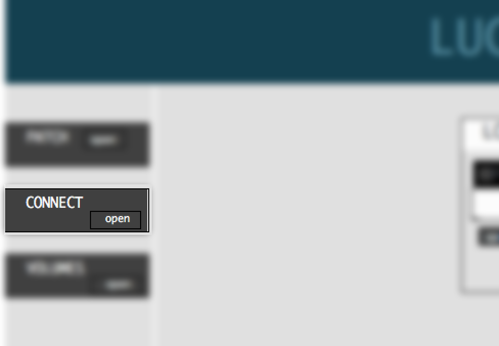
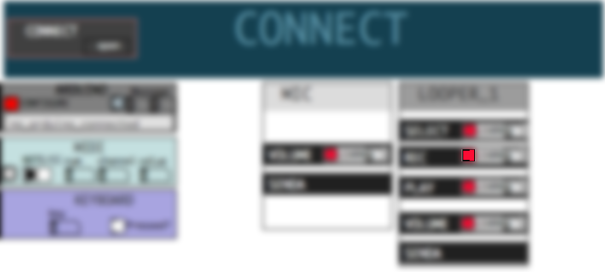
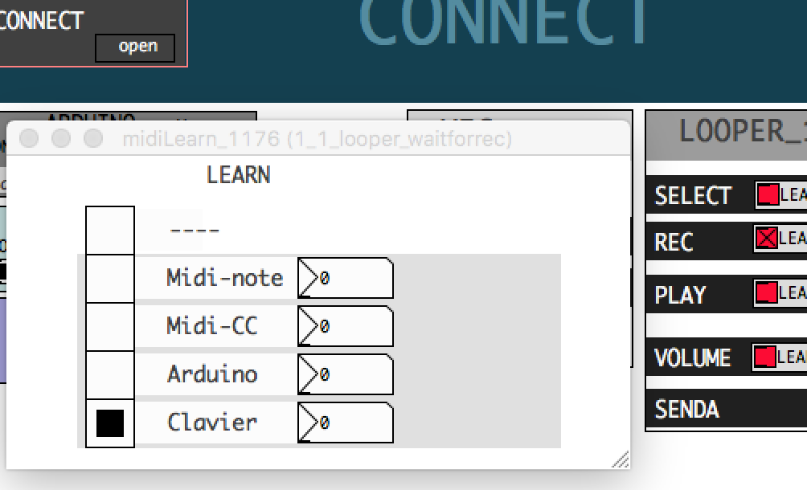

# Control software

From each Lucibox software there is a **connect** button.

click on **open** button, and the connect windows appears.
This windows allows you to control an most of the parameters of the software, from Keyboard, Midi Controler ,or Arduino. 
Makey Makey or TouchBoard acts as a Keyboard, indeed they work too.

The link between the parameter and your controler is more or less as **midi learn**. You first select a parameter, then click/move your controler and the link is done ! ( magically )

Once the connect window is open, there is 3 boxes related to the input.

# Input 
input boxes display each message received from controler

## Arduino
Arduino is the most powerful tool because you can personalise everything on it. But you need also to insert code into it, and realise electronic shematics. There is level1_arduino documentation file.

If your shematics and code are done, the arduino input box is reacting to a press or a move of a potentiometer ... since you have choosen the right serial port.  Click on **configure** button to select the right Serial port. Then each message sent from Arduino is displayed here ( number / value )

## Midi

Midi message received from a midi controler are displayed here. Midi Note and Midi CC (control change ) are different messages. Basically, midi note are sent from Midi Keyboard, and midi CC from knobs, or sliders.

## Keyboard

Each letter or symbol from a keyboard are received as a number in PureData, pressed or release.  The first issue with keyboard is repetition. Once you press a letter during a long time ( more than 2 sec at least ), the keyboard is simulating than you press and release the key at a really fast frequency. This can be change by yourself into your OS settings , but can't be set in PureData itself, and makes the use of keyboard really limited as an music controller. 

# Parameter
Connect windows contains boxes for audio modules ( looper , mic, sampler ... ). 

Each module contains a list of parameters.

Each parameter is described by a name, and get a tiny **LEARN** box.

This **LEARN** box act as *Midi Learn* and is able to link this parameter from the controler you moved, and save it .

# Learn

To do so, click the on the tiny red square beside the parameter you want to control :

Then a small window appears:

Once you move a controller, the windows reacts, save the controller you moved, then automatically close after 2 seconds.

If you move your controller now, the number on the right of the parameter is moving.

# Delete Learning

If you don't want to control this parameter anymore, open the midi learn window and and click on the first line ( ----) to select it. The *link* is deleted, and the window close automatically.

