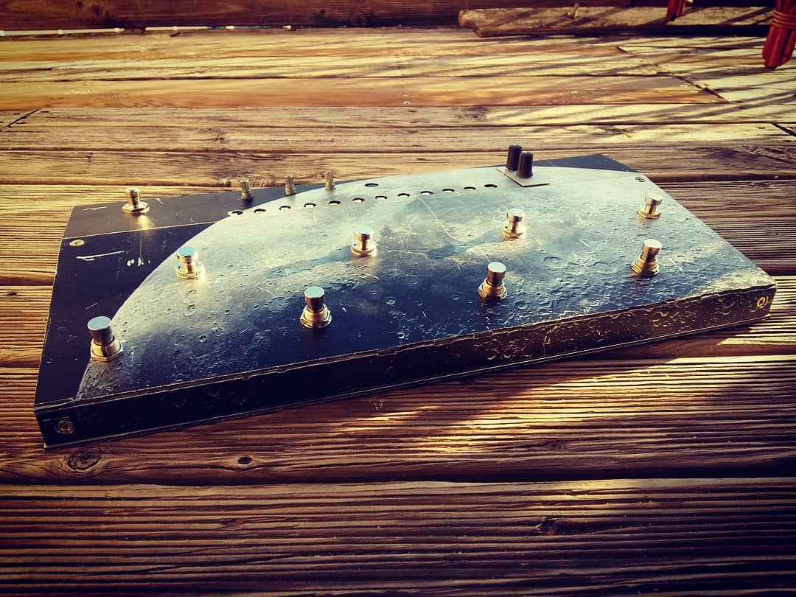

# Machines 1 : Moon LoopStation

> English documentation starts the below the french doc.

Tutorial 

Voici le lien de la vidéo tuto [link](https://www.youtube.com/watch?v=dRp9piBg44w)

# Image de la carte SD
[télécharger ici](http://assoundessens.fr/storage/lucibox/sd-card-image/moon_loopstationV2.zip)

## Caractéristiques

Moon Loopstation est une looper 4 voies, capable d'enregistrer et de ré-ouvrir des sessions, charger des fichiers .wav, avec une faible latence et un son définitivement pro.

- 4 voies indépendantes et syncro
- Enregistrement et chargement des sessions sur 12 mémoires
- Reverbe et Delay 
- Bouton pour arrêter/reprendre/effacer toutes les pistes
- Connection Wifi, pour ajouter des fichiers .wav, gérer les volumes ... etc
- Gestion claire des couleurs et volumes
- Leger, et fait pour être manipulé avec les pieds
- 1 entrée stéréo, 1 sortie stéréo

# Les besoins ?

## Composants

| Amount | Name                           | Ebay link                                                    |
| ------ | ------------------------------ | ------------------------------------------------------------ |
| 9      | Footswitch                     | [link](https://www.ebay.com/sch/i.html?_from=R40&_nkw=momentary+foot+switch+guitar) |
| 1      | standard switch                | [link](https://www.ebay.com/sch/i.html?_from=R40&_nkw=push+button+switch) |
| 3      | potentiometer                  | [link](https://www.ebay.com/sch/i.html?_from=R40&_nkw=potentiometer) |
| 13     | JR cable                       | [link](https://www.ebay.com/sch/i.html?_from=R40&_nkw=jr+cable) |
| 1      | sensor shield                  | [link](https://www.ebay.com/sch/i.html?_from=R40&_nkw=sensor+shield) |
| 12     | led addressable . 60 led / m . | [link](https://www.ebay.com/sch/i.html?_from=R40&_trksid=m570.l1313&_nkw=WS2812+60leds%2Fm) Probably can't buy under 1m |

## Carte

| Name      | type        | price ( + or -) | link                                                         |
| --------- | ----------- | --------------- | ------------------------------------------------------------ |
| Arduino   | arduino uno | 7 euros         | [link1](http://arduino.cc) [link2](https://www.ebay.com/sch/i.html?_from=R40&_trksid=m570.l1313&_nkw=uno+arduino+board+-ch340) |
| Raspberry | model 3     | 35 euros        | [link](https://www.kubii.fr/les-cartes-raspberry-pi/1628-raspberry-pi-3-modele-b-1-gb-kubii-640522710850.html) |
| PiSound   | -           | 99 euros        | [link](http://blockas.io)                                    |

## Raspberry Pi extras

| Name             | spec                                          | price ( + or -) |
| ---------------- | --------------------------------------------- | --------------- |
| RPI power supply | 5v, micro usb, 2A min., ( official is better) | 10 euros        |
| micro sd card    | 8 gb , class 10                               | 10 euros        |

# Materiaux

- ( Dibond ) plate ( 400 mm * 460 mm minimum). Il est possble de le trouver en recup' sur les plaques offset d'imprimerie. 
- Bois ( 40mm thickness min)  300mm X 10 mm
- Vis à bois

# Tools

- Perceuse ( et mêche métal )
- Scie à bois
- Fer à souder ( électronique )
- Cutter ( large et solide )
- Règle métal ( > 50 cm )
- Serre-joint, étau ... et surement quelques outils pratiques 

# Plan, Disposition

# Fonctionnement

## Wifi connection 
Grâce au logiciel VNC Viewer [ telecharger ici]( http://realvnc.com ).
Connection au réseau lucibox ( nom : **luciboxnet**, mot de passe **luciboxnet** ).
Connection à l'adresse IP : **patchbox.local**
Login : patch
password : raspberry

## Volumes

2 volumes sont disponibles en façade grâce aux potentiomètres intégrés dans la carte PiSound. Un potentiomètre de gain d'entrée, et un potentiomètre de gain de sortie. Pour contrôler les volumes des boucles séparemment, rendez-vous sur l'onglet **volumes** du logiciel , depuis la connection wifi

## Voie du looper

Il y 4 voies dans cette pédale de boucle. Chaque voie possède : 

- 1 bouton rec pour l'enregistrement ( un appui commencer, un appui pour terminer )
- 1 bouton play ( ** appui court**) ou effacer (**appui long**)
- 1 led rouge : une boucle est en cours d'enregistrement
- 1 led blanche : une boucle est présente/enregistrée
- 1 led verte : une boucle est en lecture

## Entrée(s) sonore(s)

La carte PiSound possède une entrée jack stéréo ... ce qui ne permet pas de brancher 2 instruments directement dessus. Il faut donc utilise un séparateur ... jack stéréo male vers 2 jack mono femelle. Il est alors possible de gérer 2 instruments mono.

## bouton global : lecture / stop / effacer 4 voies

**appui court** 

Toutes les voies en courts de lecture sont arretées immédiatement. Un nouvel appui re-démarre toutes les voies prédécemment en lecture.

**appui long = RESET**

Remise à zéro. Toutes les pistes sont effacées. Cette action provoque un leger bruit de buzz car les tableaux mémoires sont ré-initialiser... à corriger

---
*English English English English English English English English English English*

# Tutorial video

Here is the link of the youtube video [link](https://www.youtube.com/watch?v=dRp9piBg44w)

# SD Card Image
[download here](http://assoundessens.fr/storage/lucibox/sd-card-image/lucibox-moonloopstation.zip))

## Features

Moon LoopStation is a 4 channels looper, able to save and open session, and load .wav files, with a low latency sound card.

- 4 sync and independant channels
- save and open session over 12 memory
- add reverb and delay to you sound
- stop all / play all button
- wifi connection to open .wav files
- 3 leds per channel , avoid confusion
- compact and made with footswith

# What do you need ?

## Components

| Amount | Name                           | Ebay link                                                    |
| ------ | ------------------------------ | ------------------------------------------------------------ |
| 9      | Footswitch                     | [link](https://www.ebay.com/sch/i.html?_from=R40&_nkw=momentary+foot+switch+guitar) |
| 1      | standard switch                | [link](https://www.ebay.com/sch/i.html?_from=R40&_nkw=push+button+switch) |
| 3      | potentiometer                  | [link](https://www.ebay.com/sch/i.html?_from=R40&_nkw=potentiometer) |
| 13     | JR cable                       | [link](https://www.ebay.com/sch/i.html?_from=R40&_nkw=jr+cable) |
| 1      | sensor shield                  | [link](https://www.ebay.com/sch/i.html?_from=R40&_nkw=sensor+shield) |
| 12     | led addressable . 60 led / m . | [link](https://www.ebay.com/sch/i.html?_from=R40&_trksid=m570.l1313&_nkw=WS2812+60leds%2Fm) Probably can't buy under 1m |

## Boards

| Name      | type        | price ( + or -) | link                                                         |
| --------- | ----------- | --------------- | ------------------------------------------------------------ |
| Arduino   | arduino uno | 7 euros         | [link1](http://arduino.cc) [link2](https://www.ebay.com/sch/i.html?_from=R40&_trksid=m570.l1313&_nkw=uno+arduino+board+-ch340) |
| Raspberry | model 3     | 35 euros        | [link](https://www.kubii.fr/les-cartes-raspberry-pi/1628-raspberry-pi-3-modele-b-1-gb-kubii-640522710850.html) |
| PiSound   | -           | 99 euros        | [link](http://blockas.io)                                    |

## Raspberry Pi extras

| Name             | spec                                          | price ( + or -) |
| ---------------- | --------------------------------------------- | --------------- |
| RPI power supply | 5v, micro usb, 2A min., ( official is better) | 10 euros        |
| micro sd card    | 8 gb , class 10                               | 10 euros        |

# Materials

- Aluminium composite panel ( Dibond ) plate ( 400 mm * 460 mm minimum)
- Wood ( 40mm thickness min)  300mm X 10 mm
- wood screw

# Tools

- Drill ( with metal drill )
- Wood saw
- Electronic soldering iron
- Cutter ( big and fat)
- Big and fat rule
- Probably clamp and other extra stuff

# Layout

# How does it work?

## Volumes, level

Input volumes and output are set from the PiSound card, and its potentiometer.

## channels

There is 4 channels. Each channel has

- 1 footswitch record ( one press start recording, one press ends recording)
- 1 footswitch play ( **short press**) or delete (**long press**)
- 1 led red : recording
- 1 led white : a loop is recorded, exist
- 1 led green : a loop is playing

## stop all / play all  / delete all button

**short press** 

This button stop all channel actually playing, and play all the channels stopped

**long press = RESET**

This action delete all the loops, and is equivalent to a <u>reset</u> of the pedal.

## Syncro of recording

### Case 1 : Nothing is playing

If there is no loop playing, then the loopstation is stopped.

Press the record button one time to start recording, then press again to stop recording.

 At the point, the recording of a new loop is going to set a new tempo to the loopstation

### Case 2 : One or more loop are playing

If there is already loops playing, then the tempo is already set. Once you press the record button, the looper is waiting for the new  cycle before recording. At this point,  the red led of recording is blinking.

Once the cycle start, the led is red and not blinking anymore, and the looper is recording. Your recording can be longer than the previous one ! When you finish, one press of the rec button begin the stop precedure: the red led is blinking unitl the next cycle.

At least, channels can be set of different size, but are always multiple one from each other.

## Syncro of playing

## Wifi connection 
Download software VNC Viewer [ telecharger ici]( http://realvnc.com ).
Connect to lucibox network ( nom : **luciboxnet**, mot de passe **luciboxnet** ).
open vnc session with the ip : **patchbox.local**
Login : patch
password : raspberry

Then you can access to Luxibox looper gui and edit volumes, effect and ... almost everything

