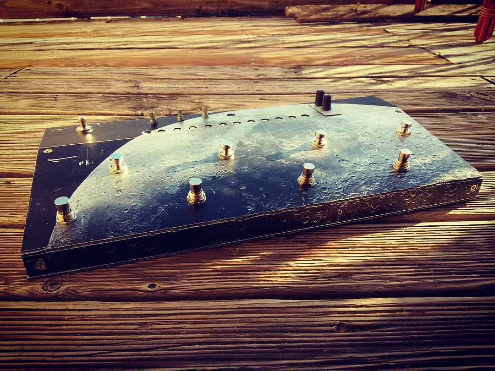

# Machines 2 : Moon LoopStation

> La documentation en français est placée en bas de page.

# Tutorial video

Here is the link of the youtube video

## Features

Moon LoopStation is a 4 channels looper, able to save and open session, and load .wav files, with a low latency sound card.

- 4 sync and independant channels
- save and open session over 12 memory
- add reverb and delay to you sound
- stop all / play all button
- wifi connection to open .wav files
- 3 leds per channel , avoid confusion
- compact and made with footswith

# What do you need ?

## Components

| Amount | Name                           | Ebay link                                                    |
| ------ | ------------------------------ | ------------------------------------------------------------ |
| 9      | Footswitch                     | [link](https://www.ebay.com/sch/i.html?_from=R40&_nkw=momentary+foot+switch+guitar) |
| 1      | standard switch                | [link](https://www.ebay.com/sch/i.html?_from=R40&_nkw=push+button+switch) |
| 3      | potentiometer                  | [link](https://www.ebay.com/sch/i.html?_from=R40&_nkw=potentiometer) |
| 13     | JR cable                       | [link](https://www.ebay.com/sch/i.html?_from=R40&_nkw=jr+cable) |
| 1      | sensor shield                  | [link](https://www.ebay.com/sch/i.html?_from=R40&_nkw=sensor+shield) |
| 12     | led addressable . 60 led / m . | [link](https://www.ebay.com/sch/i.html?_from=R40&_trksid=m570.l1313&_nkw=WS2812+60leds%2Fm) Probably can't buy under 1m |

## Boards

| Name      | type        | price ( + or -) | link                                                         |
| --------- | ----------- | --------------- | ------------------------------------------------------------ |
| Arduino   | arduino uno | 7 euros         | [link1](http://arduino.cc) [link2](https://www.ebay.com/sch/i.html?_from=R40&_trksid=m570.l1313&_nkw=uno+arduino+board+-ch340) |
| Raspberry | model 3     | 35 euros        | [link](https://www.kubii.fr/les-cartes-raspberry-pi/1628-raspberry-pi-3-modele-b-1-gb-kubii-640522710850.html) |
| PiSound   | -           | 99 euros        | [link](http://blockas.io)                                    |

## Raspberry Pi extras

| Name             | spec                                          | price ( + or -) |
| ---------------- | --------------------------------------------- | --------------- |
| RPI power supply | 5v, micro usb, 2A min., ( official is better) | 10 euros        |
| micro sd card    | 8 gb , class 10                               | 10 euros        |

# Materials

- Aluminium composite panel ( Dibond ) plate ( 400 mm * 460 mm minimum)
- Wood ( 40mm thickness min)  300mm X 10 mm
- wood screw

# Tools

- Drill ( with metal drill )
- Wood saw
- Electronic soldering iron
- Cutter ( big and fat)
- Big and fat rule
- Probably clamp and other extra stuff